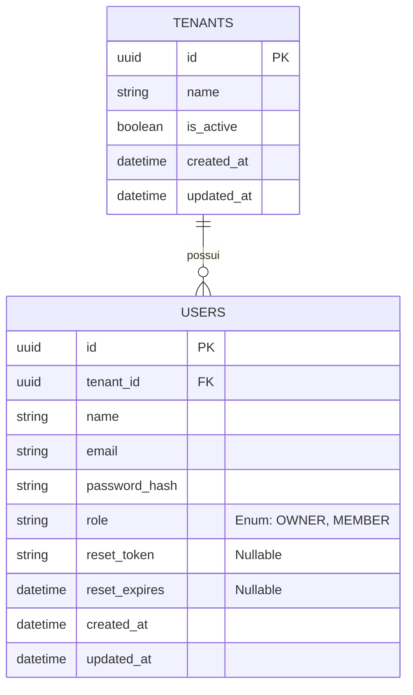

## Banco de dados

Tabelas


Arquitetura de pastas:

```
src/
├── modules/
│   ├── auth/              ✅ (Vamos focar aqui primeiro)
│   ├── tenant/            ✅ (Vamos focar aqui primeiro)
│   ├── rbac/              ⏳ (Futuro: Perfis e Permissões)
│   ├── billing/           ⏳ (Futuro: Integração Stripe)
│   └── notifications/     ⏳ (Futuro: Disparo de Emails)
├── shared/
│   ├── infra/database/    # Conexão com PostgreSQL
│   └── http/              # Servidor Node.js (Express/Fastify)
```

